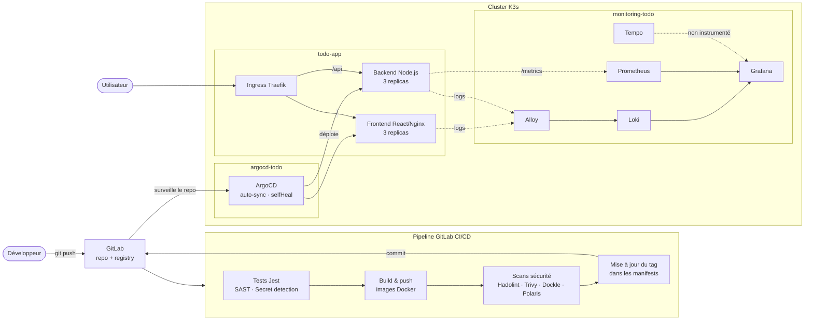

# Déploiement GitOps d'une application full-stack sur Kubernetes

Chaîne DevOps complète pour une application **Todo (React + Node.js/Express)** : conteneurisation durcie, pipeline GitLab CI/CD avec scans de sécurité, déploiement GitOps via **ArgoCD** et observabilité avec la stack **LGTM + Alloy**, sur un cluster **K3s multi-nœuds**.

> Projet réalisé dans le cadre de ma formation (ESGI), sur 4 semaines. Le code applicatif (Todo App) était fourni ; les Dockerfiles, manifests Kubernetes, pipeline CI/CD, configuration GitOps et monitoring sont mon travail.

---

## 🔄 Avant / Après

**Avant :** build des images en local, `docker push` manuel, `kubectl apply` à la main, aucune visibilité sur l'état de l'application.
**Après :** un `git push` suffit. Le pipeline teste, construit, scanne et met à jour le tag d'image dans Git ; ArgoCD synchronise le cluster automatiquement ; logs et métriques remontent dans Grafana.

| Domaine | Demandé par l'énoncé | Réalisé |
|---|---|---|
| **Cluster** | Minikube (mono-nœud) | Cluster **K3s** multi-nœuds (2 control-plane + 3 workers), namespaces dédiés par brique |
| **Dockerfiles** | Templates à compléter | Multi-stage Alpine, utilisateur non-root, npm/npx retirés de l'image finale, `HEALTHCHECK` |
| **Manifests K8s** | Exemples fournis | 3 replicas, RollingUpdate sans interruption (`maxUnavailable: 0`), probes, requests/limits, durcissement (non-root, filesystem read-only, `drop: ALL`, seccomp) → **score Polaris 92/100** |
| **CI/CD** | Pipeline GitLab | 5 stages : tests Jest, SAST, détection de secrets, build/push registry, scans **Hadolint / Trivy / Dockle / Polaris**, mise à jour automatique du tag d'image |
| **GitOps** | ArgoCD ou FluxCD | Instance **ArgoCD** dédiée, sync automatique avec `prune` + `selfHeal` : le CI ne touche plus jamais au cluster |
| **Monitoring** | Stack LGTM + Alloy | Prometheus (`kube-prometheus-stack`) + `ServiceMonitor` pour les métriques applicatives, Loki alimenté par Alloy, datasources Grafana provisionnées automatiquement |

---

## 🏗️ Architecture



---

## 🛠️ Stack technique

| Catégorie | Outils |
|---|---|
| Application | React 18, Node.js 20, Express, Jest |
| Conteneurs | Docker (multi-stage, Alpine), Nginx |
| Orchestration | Kubernetes (K3s), Ingress Traefik |
| CI/CD | GitLab CI, GitLab Container Registry |
| Sécurité | GitLab SAST & Secret Detection, Hadolint, Trivy, Dockle, Polaris |
| GitOps | ArgoCD |
| Observabilité | Grafana, Prometheus, Loki, Tempo, Alloy, Helm |

---

## ⚙️ Pipeline CI/CD

```
test → secret-detection → build → security → push
```

| Job | Rôle |
|---|---|
| `test-backend` | Tests unitaires Jest |
| `sast` / `secret_detection` | Analyse statique du code et recherche de secrets (templates GitLab) |
| `build-backend` / `build-frontend` | Build et push des images, taguées avec le SHA du commit |
| `hadolint` | Lint des Dockerfiles |
| `trivy` | Scan de CVE : le pipeline échoue sur toute vulnérabilité HIGH ou CRITICAL |
| `dockle` | Audit CIS des images |
| `polaris` | Audit des bonnes pratiques des manifests Kubernetes |
| `update-manifests` | Met à jour le tag d'image dans `k8s/` et commit → déclenche la synchro ArgoCD |

> Le pipeline a été conçu pour GitLab CI (`.gitlab-ci.yml`) ; il ne s'exécute pas sur GitHub.

---

## 🔐 Durcissement

- **Images** : multi-stage, base Alpine, utilisateur non-root (UID fixe), outils de build absents de l'image finale
- **Pods** : `runAsNonRoot`, `readOnlyRootFilesystem`, `allowPrivilegeEscalation: false`, `capabilities.drop: ALL`, `seccompProfile: RuntimeDefault`, `automountServiceAccountToken: false`
- **Ressources** : requests et limits CPU/mémoire sur chaque conteneur
- **Contrôles automatiques** à chaque pipeline : SAST, détection de secrets, Trivy, Dockle, Hadolint, Polaris

---

## 📊 Observabilité

- **Logs** : Alloy découvre les pods via l'API Kubernetes et envoie leurs logs à Loki (multi-tenant)
- **Métriques** : le backend expose `/metrics` (`prom-client`), scrapé par Prometheus via un `ServiceMonitor` (`http_requests_total`, `http_request_duration_seconds`, `todo_operations_total`)
- **Grafana** : datasources Loki, Prometheus et Tempo provisionnées automatiquement par ConfigMap

---

## 🚧 Limites et pistes d'amélioration

- **Traces** : Tempo est déployé et branché à Grafana, mais l'application n'est pas encore instrumentée avec OpenTelemetry. Prochaine étape : SDK OpenTelemetry côté backend, export OTLP vers Tempo.
- **Réseau et disponibilité** : ajouter `NetworkPolicy`, `PodDisruptionBudget` et `topologySpreadConstraints` (warnings Polaris restants).
- **TLS** sur l'Ingress (cert-manager).
- **Secrets** : chiffrer les secrets dans Git (Sealed Secrets ou SOPS).

---

## 📁 Structure du dépôt

```
├── backend/            # API Express + tests Jest + Dockerfile
├── frontend/           # React + config Nginx + Dockerfile
├── k8s/                # Manifests (Deployments, Services, ConfigMaps, Ingress)
├── docs/               # Comptes rendus détaillés, semaine par semaine
├── .gitlab-ci.yml      # Pipeline CI/CD
└── polaris-config.yaml # Règles d'audit des manifests
```

📖 Documentation détaillée : [Semaine 1 — Dockerfiles](docs/Semaine-1/CR_SEM1.md) · [Semaine 2 — Kubernetes & CI/CD](docs/Semaine-2/CR_SEM2.md) · [Semaine 3 — GitOps](docs/Semaine-3/CR_SEM3.md) · [Semaine 4 — Monitoring](docs/Semaine-4/CR_SEM4.md)
