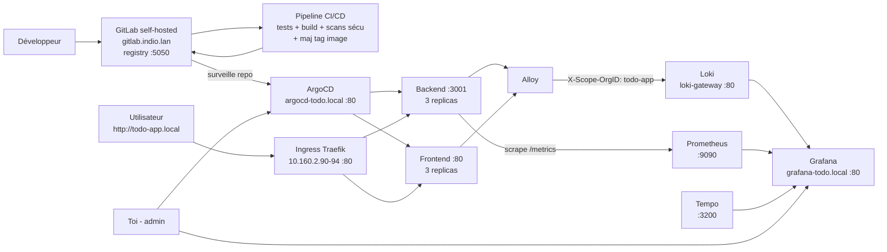

# Semaine 4 — Monitoring (Stack LGTM + Alloy)

## Objectif

Mettre en place l'observabilité complète de l'application Todo App : logs, métriques et traces, via la stack LGTM (Loki, Grafana, Tempo, Mimir/Prometheus) et l'agent Alloy.

---

## Livrables produits

| Livrable | Statut |
|---|---|
| Prometheus + Grafana installés (`kube-prometheus-stack`) | ✅ Complet |
| Loki installé (agrégation de logs) | ✅ Complet |
| Tempo installé (traces distribuées) | ✅ Complet |
| Alloy installé (agent de collecte) | ✅ Complet |
| Datasources Grafana configurées (Loki, Tempo, Prometheus) | ✅ Complet |
| Logs de `todo-app` visibles dans Grafana | ✅ Complet |
| Métriques custom du backend visibles dans Grafana | ✅ Complet |
| Traces | ⚠️ Stack opérationnelle, mais app non instrumentée (voir limitation) |
| Accès web permanent à Grafana (Ingress) | ✅ Complet |

---

## 1. Namespace dédié

Comme pour ArgoCD (semaine 3), la stack de monitoring est installée dans un namespace dédié **`monitoring-todo`**, isolé du reste du cluster partagé. Vérification préalable : aucune stack de monitoring partagée n'existait déjà sur le cluster (contrairement à ArgoCD et Polaris).

---

## 2. Installation via Helm

```bash
helm repo add grafana https://grafana.github.io/helm-charts
helm repo add prometheus-community https://prometheus-community.github.io/helm-charts
helm repo update

kubectl create namespace monitoring-todo
```

### Prometheus + Grafana (`kube-prometheus-stack`)
```bash
helm install kube-prometheus-stack prometheus-community/kube-prometheus-stack \
  --namespace monitoring-todo \
  --set grafana.adminPassword='TodoApp2026!' \
  --set prometheus.prometheusSpec.retention=3d \
  --set prometheus.prometheusSpec.resources.requests.cpu=100m \
  --set prometheus.prometheusSpec.resources.requests.memory=256Mi \
  --set alertmanager.alertmanagerSpec.resources.requests.cpu=25m \
  --set alertmanager.alertmanagerSpec.resources.requests.memory=64Mi
```
Ce chart installe en une fois : Prometheus, Grafana, Alertmanager, node-exporter (métriques des nœuds) et kube-state-metrics (métriques des objets Kubernetes).

### Loki (mode single binary)
```bash
helm install loki grafana/loki \
  --namespace monitoring-todo \
  --set deploymentMode=SingleBinary \
  --set loki.commonConfig.replication_factor=1 \
  --set loki.storage.type=filesystem \
  --set loki.useTestSchema=true \
  --set singleBinary.replicas=1 \
  --set read.replicas=0 \
  --set write.replicas=0 \
  --set backend.replicas=0 \
  --set chunksCache.enabled=false \
  --set monitoring.selfMonitoring.enabled=false \
  --set monitoring.serviceMonitor.enabled=false \
  --set test.enabled=false
```
Mode "single binary" choisi plutôt que le mode distribué (microservices) — plus simple, suffisant pour le volume de logs de ce projet. Le cache mémoire (`chunksCache`) a été désactivé car son besoin en RAM par défaut dépassait la capacité de plusieurs nœuds du cluster (optionnel, pas de perte de fonctionnalité).

Loki fonctionne avec le multi-tenancy activé par défaut : toutes les requêtes (écriture et lecture) doivent porter un header `X-Scope-OrgID`.

### Tempo (mode single binary)
```bash
helm install tempo grafana/tempo \
  --namespace monitoring-todo \
  --set tempo.resources.requests.cpu=50m \
  --set tempo.resources.requests.memory=128Mi
```

### Alloy (agent de collecte)
Alloy est configuré pour découvrir les pods via l'API Kubernetes et transférer leurs logs vers Loki :
```river
discovery.kubernetes "pods" {
  role = "pod"
}

loki.source.kubernetes "pods" {
  targets    = discovery.kubernetes.pods.targets
  forward_to = [loki.write.default.receiver]
}

loki.write "default" {
  endpoint {
    url = "http://loki-gateway.monitoring-todo.svc.cluster.local/loki/api/v1/push"
    headers = {
      "X-Scope-OrgID" = "todo-app",
    }
  }
}
```
Déployé en une seule replica (`controller.type=deployment`) — `loki.source.kubernetes` lit les logs via l'API Kubernetes plutôt que par fichier local, donc pas besoin d'un DaemonSet.

---

## 3. Problèmes rencontrés

| Problème | Cause | Correction |
|---|---|---|
| `You must provide a schema_config for Loki` | Chart Loki exige un schéma explicite | `--set loki.useTestSchema=true` (suffisant pour ce projet, pas de vrai besoin de rétention long terme) |
| `4 Insufficient memory` sur `loki-chunks-cache` | Cache mémoire par défaut trop gourmand pour la capacité du cluster | `chunksCache.enabled=false` |
| Pods `Evicted` en rafale (Grafana, kube-state-metrics, node-exporter, loki-canary) | Pic de pression mémoire pendant l'installation simultanée de plusieurs composants | Résolu tout seul après stabilisation ; nettoyage des pods évincés avec `kubectl delete pod --field-selector=status.phase=Failed` |
| Datasources Grafana pas prises en compte au premier essai | Mauvais nom de conteneur sidecar utilisé pour vérifier les logs (le pod ciblé par le sélecteur était un des nombreux pods évincés, pas celui qui tournait réellement) | Cibler le pod effectivement `Running` |
| `{namespace="todo-app"}` ne renvoie aucun log | La configuration Alloy simplifiée ne "relabel" pas les métadonnées Kubernetes (`__meta_kubernetes_namespace`) vers un label `namespace` exploitable | Requête adaptée au label réellement produit : `{instance=~"todo-app/.*"}` (format `namespace/nom-du-pod`) |

---

## 4. Datasources Grafana

Provisionnées automatiquement via un ConfigMap détecté par le sidecar Grafana (label `grafana_datasource: "1"`) :

```yaml
apiVersion: v1
kind: ConfigMap
metadata:
  name: grafana-datasources-todo
  namespace: monitoring-todo
  labels:
    grafana_datasource: "1"
data:
  loki-tempo-datasources.yaml: |
    apiVersion: 1
    datasources:
    - name: Loki
      type: loki
      access: proxy
      url: http://loki-gateway.monitoring-todo.svc.cluster.local
      jsonData:
        httpHeaderName1: "X-Scope-OrgID"
      secureJsonData:
        httpHeaderValue1: "todo-app"
    - name: Tempo
      type: tempo
      access: proxy
      url: http://tempo.monitoring-todo.svc.cluster.local:3200
```
Prometheus est configuré automatiquement par défaut par le chart `kube-prometheus-stack`.

### Métriques custom du backend

Un `ServiceMonitor` a été ajouté pour que Prometheus scrape l'endpoint `/metrics` du backend (métriques `prom-client` déjà exposées depuis la semaine 1) :
```yaml
apiVersion: monitoring.coreos.com/v1
kind: ServiceMonitor
metadata:
  name: todo-backend
  namespace: todo-app
  labels:
    release: kube-prometheus-stack
spec:
  selector:
    matchLabels:
      app: todo-backend
  endpoints:
  - port: http
    path: /metrics
    interval: 30s
```

---

## 5. Vérification

**Logs** (Grafana → Explore → Loki) :
```
{instance=~"todo-app/.*"}
```
→ Logs HTTP réels du backend visibles (requêtes `GET /health`, `/ready`, `/`, etc.)

**Métriques** (Grafana → Explore → Prometheus) :
```
todo_operations_total
```
→ `todo_operations_total{container="todo-backend", endpoint="http", ...}` remonte correctement.

**Traces** — limitation connue : Tempo est installé et configuré comme datasource, mais l'application (backend/frontend) n'a aucune instrumentation OpenTelemetry. Aucune trace n'est donc générée. Pour aller plus loin, il faudrait ajouter le SDK OpenTelemetry côté backend Node.js et configurer l'export vers Tempo (OTLP, port 4317/4318) — non fait dans le cadre de ce projet, l'objectif "stack opérationnelle" étant rempli sans instrumentation applicative.

---

## 6. Accès web (Ingress)

| Service | URL |
|---|---|
| Grafana | http://grafana-todo.local |

Identifiants : `admin` / voir variable définie à l'installation (`grafana.adminPassword`).

---

## 7. Schéma d'architecture globale



---

## Conclusion Semaine 4

La stack LGTM + Alloy est opérationnelle :
- **Logs** : collectés en continu par Alloy, agrégés dans Loki, consultables dans Grafana
- **Métriques** : infrastructure (nœuds, objets K8s) et applicatives (`todo_operations_total`, etc.) scrapées par Prometheus
- **Traces** : infrastructure prête (Tempo + datasource Grafana), instrumentation applicative non réalisée (limitation documentée)
- **Accès permanent** à Grafana via Ingress, sans port-forward

Projet complet : les 4 semaines de la chaîne DevOps/GitOps (code + Dockerfiles → Kubernetes + CI/CD → GitOps ArgoCD → Monitoring LGTM) sont livrées.
